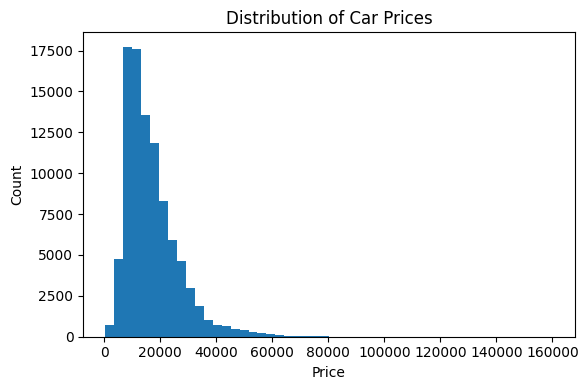
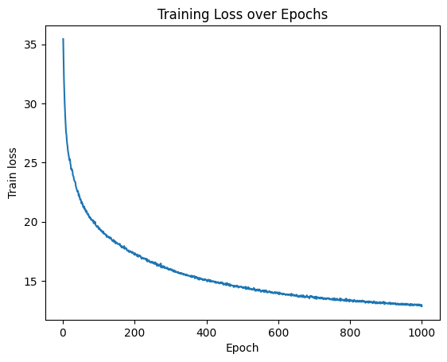
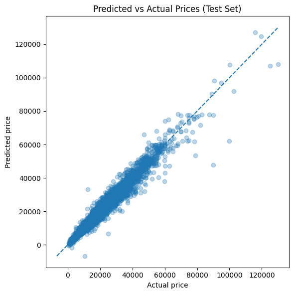
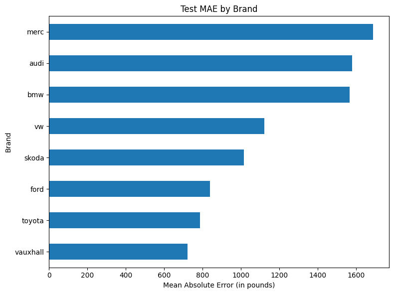

# Car Price Prediction – Neural Network from Scratch (NumPy Only)

This project implements a small neural network from scratch, using only NumPy, to predict used car prices from a real-world dataset of listings scraped from the UK market.

The main goals are:

- To understand how neural networks actually work internally (forward pass, backpropagation, optimization).
- To see how to combine categorical features (via embeddings) and numeric features in a regression model.
- To build a clean, readable mini-project that can be extended and experimented with.
---

## 0. How to run?

Make sure to copy this repository using :

/data contains 11 csv files
/utils contains 3 .py files that implement the dense layers, embedding, and optimizer (explained below)

To recreate the project, run main.ipynb, the notebook containing the following:

- Library/module load
- Data pre-processing
- Exploratory data analysis
- Embedding of categorical variables
- Set up of the neural network
- training loop
- results


## 1. How a Neural Network Works (Conceptual Overview)

At a high level, a neural network is a function that maps inputs (features) to outputs (predictions) using a stack of simple, differentiable operations.

In this project, the network:

- Takes in car features (model, brand, transmission, fuel type, year, mileage, tax, mpg, engine size).
- Produces a single number: the predicted price (in british pounds).

The core pieces are:

- **Dense (fully connected) layers**
- **Activation functions**
- **Loss function**
- **Forward pass**
- **Backpropagation**
- **Optimizer (Adam)**
- **L2 regularization**

Each of these shows up in the `utils` folder and in `main.ipynb`.

---

### 1.1 Dense Layer

A **dense layer** (also called a fully connected layer) is the basic building block of many neural networks.

Mathematically:


$$\text{output} = XW + b$$

Where:

- $X$ is the input matrix: shape `(batch_size, n_inputs)`.
- $W$ is the weight matrix: shape `(n_inputs, n_neurons)`.
- $b$ is the bias vector: shape `(1, n_neurons)`.
- `output` is shape `(batch_size, n_neurons)`.

Each neuron computes a weighted sum of its inputs plus a bias. In code, this is implemented via matrix multiplication (`np.dot` / `@`) and a broadcasted addition of biases.

In this project, dense layers are defined in `utils/neural_network.py` and used to map from:

1. The concatenated embeddings + numeric features → hidden representation.
2. Hidden representation → next hidden layer.
3. Final hidden layer → single output neuron (predicted price).

<p align="center">
  
</p>

---

### 1.2 Activation Function

If we stack only linear (dense) layers, the entire network is still just a big linear function. To model non-linear relationships, we insert **activation functions** between dense layers.

Here we use **ReLU (Rectified Linear Unit)**:

$$
\text{ReLU}(x) = \max(0, x)
$$

Properties:

- Zeroes out negative values.
- Keeps positive values as they are.
- Introduces non-linearity.
- Simple and cheap to compute.

In the code:

- Each hidden dense layer is followed by a ReLU activation layer.
- The final output layer is left linear (no activation), which is standard for regression problems.

Activations are also implemented in `utils/neural_network.py`.

---

### 1.3 Loss Function

The **loss function** measures how good (or bad) a prediction is. During training, the network adjusts its parameters to **minimize** this loss.

For regression, we use **Mean Squared Error (MSE)**:

$$
\text{MSE}(y_{\text{pred}}, y_{\text{true}}) =
\frac{1}{N} \sum_{i=1}^N (y_{\text{pred}, i} - y_{\text{true}, i})^2
$$

Where:

- $y_{\text{pred}}$ are the predicted prices.
- $y_{\text{true}}$ are the actual prices.
- $N$ is the number of samples in the batch.

MSE penalizes large errors more strongly than small ones, which is often useful for regression tasks like price prediction.

The MSE loss class is implemented in `utils/neural_network.py` and used in the training loop inside `main.ipynb`.

---

### 1.4 Forward Pass

The **forward pass** is how we compute the network’s predictions for a given input.

In this project, for each batch:

1. **Categorical features** (model, brand, transmission, fuel type) are passed as integer indices into **embedding layers**, which look up dense vectors for each category.
2. The resulting embeddings are concatenated with the **numeric features** (year, mileage, tax, mpg, engine size).
3. This combined feature vector passes through:
   - Dense layer to ReLU
   - Dense layer to ReLU
   - Dense layer to output (predicted price, scaled)
4. The loss function (MSE) compares predictions to true targets and returns a scalar loss.

The forward pass is explicitly written layer-by-layer in `main.ipynb`, using components from `utils/neural_network.py`.

---

### 1.5 Backpropagation

To train the network, we need to know how changing each parameter (weights, biases, embeddings) affects the loss. **Backpropagation** is the algorithm that efficiently computes these gradients using the chain rule of calculus.

Workflow:

1. Start from the loss (MSE) and compute the gradient (mathematically, the derivative) with respect to the predictions.
2. Propagate gradients **backwards** through:
   - Last dense layer (output to previous layer).
   - ReLU activation.
   - Second dense layer.
   - ReLU activation.
   - First dense layer.
   - Embedding layers (for categorical features).
3. Each layer computes:
   - Gradients with respect to its inputs (to pass further back).
   - Gradients with respect to its parameters (to update them).

In this project, **every layer** has:

- A `forward()` method.
- A `backward(dvalues)` method that sets `.dweights`, `.dbiases`, `.dinputs`, etc.

Backprop is all handled manually, with NumPy operations, in `utils/neural_network.py` and the training loop in `main.ipynb`.

---

### 1.6 Optimizer and Adam

Once gradients are computed via backpropagation, we need a way to **update parameters** to reduce the loss. This is the role of an **optimizer**.

The simplest optimizer is **Stochastic Gradient Descent (SGD)**:

$$
\theta \leftarrow \theta - \eta \cdot \nabla_{\theta} \text{loss}
$$

Where:

- $\theta$ are the parameters (weights, biases, embeddings).
- $\eta$ is the learning rate.

In this project, we use **Adam** (Adaptive Moment Estimation), which is a more advanced optimizer that:

- Keeps moving averages of gradients (first moment) and squared gradients (second moment).
- Adapts the learning rate for each parameter individually.
- Typically converges faster and more robustly than plain SGD.

Adam is implemented in `utils/optimizer.py` as `Optimizer_Adam` and is called explicitly in the training loop.

---

### 1.7 L2 Regularization

**L2 regularization** (also known as weight decay) adds a penalty term to the loss that depends on the squared magnitude of the weights:

$$
\text{Loss}_{\text{total}} = \text{Loss}_{\text{data}} + \lambda \sum_{i} W_i^2
$$

Where:

- $\lambda$ is the regularization strength.
- $W_i$ are individual weights.

Why use L2?

- Encourages smaller weights.
- Helps reduce overfitting.
- Can improve generalization to new data.

In this project:

- Dense layers can include L2 regularization on weights and biases.
- The gradient for each weight includes an extra term proportional to the weight itself.

This logic is implemented in the dense layer class inside `utils/neural_network.py`.

---

## 1.8 A nice GIF that summarizes the points above


## 2. Project Structure

The project is organized as follows (focusing on the core logic):

```text
.
├── utils
│   ├── functions.py
│   ├── neural_network.py
│   └── optimizer.py
└── main.ipynb
```


## 3. Results

Running this pipeline, we obtain that our Neural Network tends to miss the price of an used car, given the model, brand, transmission, fuel type, year, mileage, tax, mpg, engine size, by about 1000 GBP or 7% in absolute terms.

<p align="center">
  
</p>


<p align="center">
  
</p>

<p align="center">
  
</p>

<p align="center">
  
</p>

